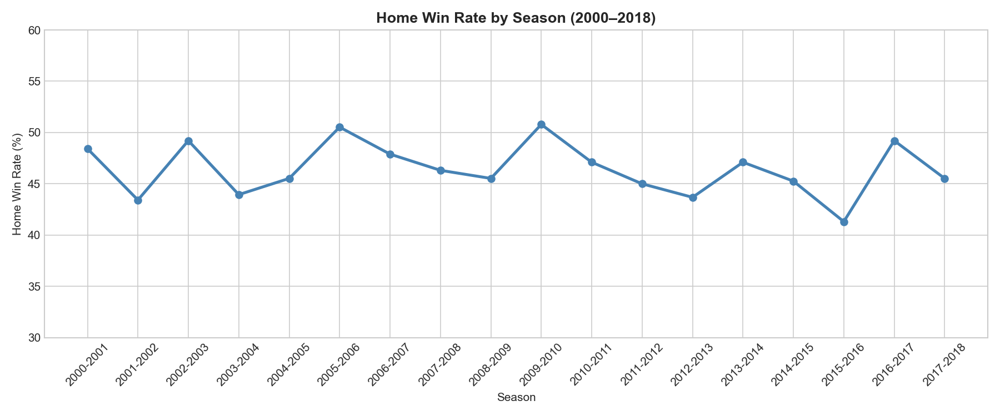
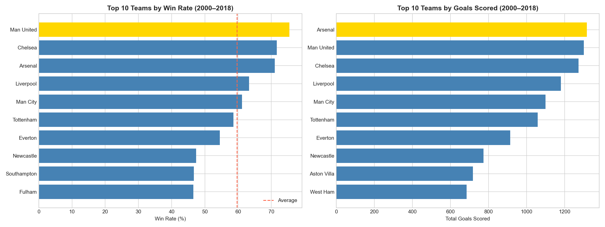
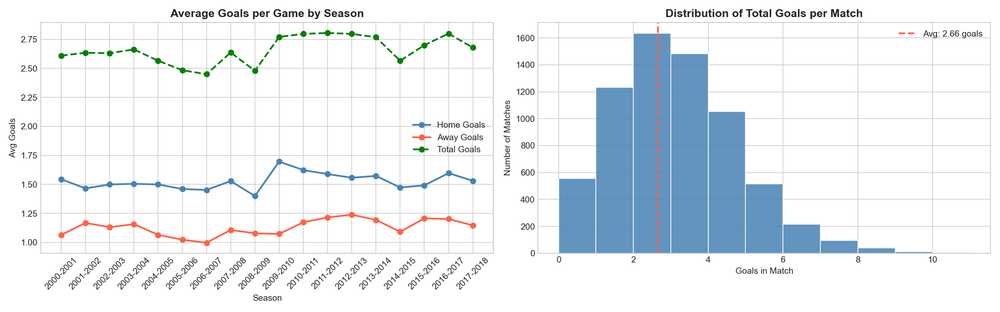
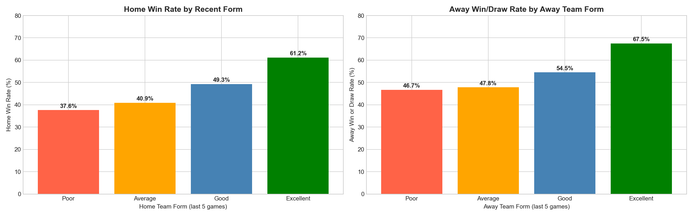
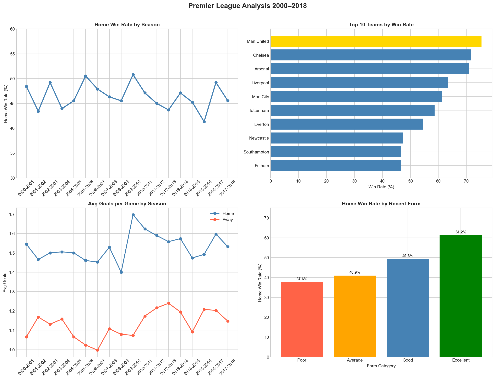

# Premier League Match Analysis (2000–2018)
### Exploratory Data Analysis of 6,840 Premier League Matches Across 18 Seasons

   

---

## Overview

End-to-end exploratory data analysis on 6,840 Premier League matches spanning 18 seasons (2000–2018). The goal was to uncover trends in home advantage, team dominance, goalscoring patterns, and the relationship between form/league position and match outcomes.

---

## Dataset

**Source:** [English Premier League Dataset — Kaggle](https://www.kaggle.com/datasets/saife245/english-premier-league)

| File | Rows | Description |
|------|------|-------------|
| final_dataset.csv | 6,840 | Match results, goals, form, streaks across 18 seasons |
| EPLStandings.csv | — | Season-end league standings |

Key columns used: `FTHG`, `FTAG`, `FTR` (result), `HTP`/`ATP` (cumulative points), `HTFormPts`/`ATFormPts` (recent form), `DiffPts`, `DiffFormPts`

---

## Analyses

### 1. Home Advantage Over Time
- Home teams won **46.4%** of all matches across 18 seasons
- Home advantage has been **gradually declining** — peaking at 50.5% in 2005-06 and hitting an all-time low of **41.3% in 2015-16**
- Home teams average **1.53 goals per game** vs 1.13 for away teams



---

### 2. Top Teams by Win Rate & Goals (2000–2018)
- **Man United** led all teams with a **75.4% win rate** — 4+ points ahead of Chelsea (71.6%) and Arsenal (71.1%)
- **Arsenal** scored the most total goals despite ranking 3rd in win rate — highlighting a gap between volume and efficiency
- A clear drop-off exists between the top 6 and the rest, with Everton (54.5%) the highest-ranked outside that group



---

### 3. Goals & Scoring Patterns
- Average of **2.66 goals per game** across all 18 seasons
- **50% of all matches** ended with 2 or fewer goals — the most common total was exactly 2
- **28.3% of matches** produced 4 or more goals
- Away goals per game rose steadily from 1.07 (2000-01) to 1.24 (2009-10), suggesting away teams became more attack-minded over time



---

### 4. Form & League Position as Predictors of Winning
- Teams in **excellent recent form** won at home **61.2%** of the time vs only **37.6%** when in poor form
- Away teams in excellent form avoided defeat **67.5%** of the time
- **League position** (cumulative points difference, r=0.302) is a stronger predictor of home wins than **recent form** (r=0.197) — suggesting consistency matters more than momentum



---

### 5. Summary Dashboard



---

## Key Findings

| Insight | Value |
|--------|-------|
| Total matches analyzed | 6,840 |
| Seasons covered | 2000–01 to 2017–18 |
| Overall home win rate | 46.4% |
| Lowest home win rate season | 2015–16 (41.3%) |
| Highest win rate team | Man United (75.4%) |
| Top goal-scoring team | Arsenal |
| Avg goals per game | 2.66 |
| Form → home win correlation | r = 0.197 |
| Points diff → home win correlation | r = 0.302 |

---

## Tools & Libraries

- **Python 3.10**
- **pandas** — data manipulation and groupby analysis
- **matplotlib / seaborn** — all visualizations
- **scipy** — correlation analysis

---

## How to Run

```bash
git clone https://github.com/fhm-nzh/premier-league-analysis
cd premier-league-analysis
pip install pandas matplotlib seaborn scipy
jupyter notebook premier_league_analysis.ipynb
```

> Download the dataset from [Kaggle](https://www.kaggle.com/datasets/saife245/english-premier-league) and place `final_dataset.csv` in the project root.

---

## Author

**Fahime** — [github.com/fhm-nzh](https://github.com/fhm-nzh)
